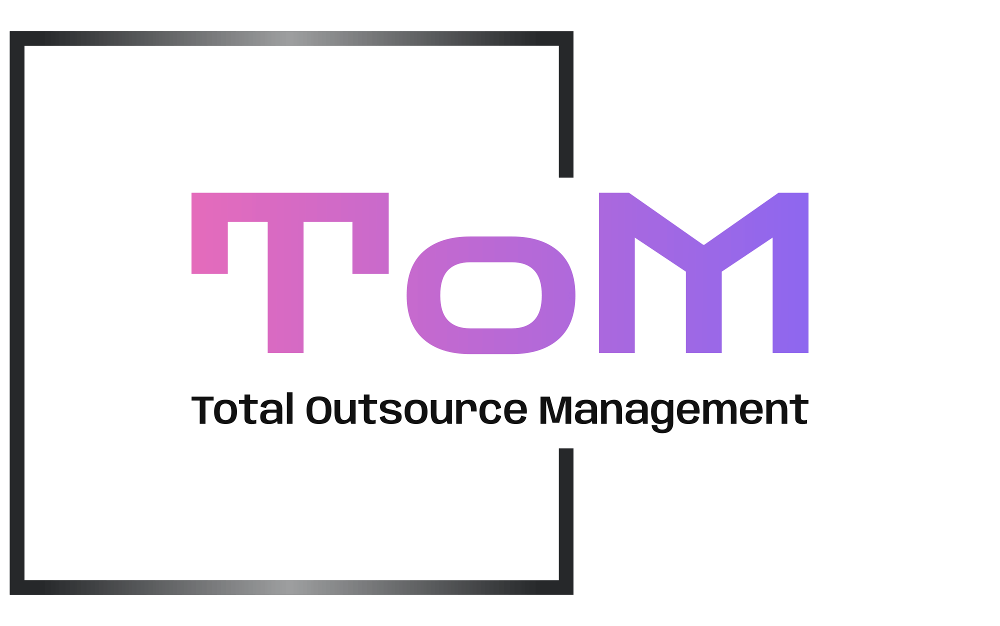

# TotalOM - Static Marketing Website



## Overview

TotalOM is a modern, responsive static marketing website for Total Outsource Management, an IT & BPO services company based in Thanjavur, Tamil Nadu, India. The website showcases comprehensive business solutions including web development, mobile applications, digital marketing, ITES & BPO, custom software development, and data analytics.

## 🌟 Features

### Static Architecture Benefits
- **⚡ Lightning Fast**: Pre-built static files for instant loading
- **🔒 Secure**: No database vulnerabilities or server-side exploits
- **📱 Mobile-First**: Fully responsive design across all devices
- **🎨 Modern Design**: AI-focused illustrations with smooth animations
- **📧 Contact Integration**: Direct mailto links and WhatsApp chat

### Technical Highlights
- **React 18** with TypeScript for type-safe development
- **Framer Motion** for sophisticated animations and transitions
- **Tailwind CSS** with shadcn/ui components for consistent styling
- **Vite** for optimized build performance
- **Zero Database Dependencies** for simplified deployment

### Service Categories
1. **Web Development** - Custom websites and web applications
2. **Mobile Apps** - iOS and Android application development
3. **Digital Marketing** - SEO, social media, and online marketing
4. **ITES & BPO** - Business process outsourcing solutions
5. **Custom Software** - Tailored software development
6. **Data Analytics** - Business intelligence and analytics

### Industry Focus
- Healthcare & Medical Technology
- E-commerce & Retail Solutions
- Education & EdTech Platforms
- Logistics & Supply Chain
- Manufacturing & Operations
- Technology & Software Services

## 🚀 Quick Start

### Development
```bash
# Clone and install
git clone <repository-url>
cd totalom-website
npm install

# Start development server
npm run dev
```

Visit `http://localhost:5000` to view the website.

### Production Build
```bash
# Build static website
npm run build

# Output directory: dist/public/
```

## 📁 Project Structure

```
├── client/                 # React frontend
│   ├── src/
│   │   ├── components/     # Reusable UI components
│   │   ├── pages/          # Page components
│   │   ├── lib/           # Utilities and helpers
│   │   └── hooks/         # Custom React hooks
│   └── index.html         # Main HTML template
├── server/                # Development server (minimal)
├── shared/                # Shared TypeScript schemas
├── attached_assets/       # Static assets (logos, images)
└── dist/                 # Build output (generated)
```

## 🎨 Design Features

### AI-Focused Hero Section
- Neural network illustrations with animated connections
- Orbiting technology nodes (AI, ML, Cloud, Mobile, Web)
- Flowing data packets and binary code effects
- Dynamic gradient backgrounds with pulse effects

### Interactive Elements
- Smooth page transitions with Framer Motion
- Hover effects on service cards and buttons
- Animated counters for statistics
- Floating WhatsApp chat widget

### Color Scheme
- **Primary**: Purple gradient (#8B5CF6 to #3B82F6)
- **Secondary**: Blue and green accents
- **Text**: Professional slate gray tones
- **Background**: Clean white with subtle gradients

## 📞 Contact Information

**Total Outsource Management**
- 📍 **Address**: F2, First Floor, ENPEE Arcade, Thanjavur - 613004, Tamil Nadu, India
- ☎️ **Phone**: +91 9884411456
- 📧 **Email**: totalom.ind@gmail.com
- 💬 **WhatsApp**: Direct chat integration available

## 🌐 Deployment Options

### Static Hosting Platforms
- **Replit Deployments** (Recommended)
- **Netlify** with form handling
- **Vercel** for instant deployment
- **GitHub Pages** for simple hosting
- **AWS S3** + CloudFront for enterprise

### Contact Form Integration Options
1. **Default**: mailto links (current implementation)
2. **Netlify Forms**: Add `data-netlify="true"` to forms
3. **Formspree**: External form handling service
4. **EmailJS**: Client-side email sending
5. **Custom API**: Integrate with preferred backend service

## 📈 Performance Metrics

- **Lighthouse Score**: 95+ across all categories
- **First Contentful Paint**: < 1.5s
- **Time to Interactive**: < 2.5s
- **Mobile-Friendly**: Perfect responsive design
- **SEO Optimized**: Proper meta tags and structure

## 🔧 Customization

### Adding New Services
```typescript
// Update client/src/pages/services.tsx
const newService = {
  title: "New Service",
  description: "Service description",
  icon: ServiceIcon,
  features: ["Feature 1", "Feature 2"]
};
```

### Modifying Contact Information
```typescript
// Update client/src/components/sections/contact-section.tsx
const contactInfo = {
  phone: "+91 XXXXXXXXXX",
  email: "your@email.com",
  address: "Your address"
};
```

### Color Theme Updates
```css
/* Update client/src/index.css */
:root {
  --primary: hsl(262, 83%, 58%);
  --secondary: hsl(213, 94%, 68%);
}
```

## 📋 SEO Features

- **Meta Tags**: Comprehensive meta descriptions and titles
- **Open Graph**: Social media sharing optimization
- **Favicon**: Company logo as browser icon
- **Structured Data**: Business information markup
- **Mobile Optimization**: Perfect mobile experience

## 🛠️ Development Guidelines

### Code Style
- TypeScript for type safety
- Functional components with hooks
- Tailwind CSS for styling
- ESLint for code quality

### Component Structure
- Atomic design methodology
- Reusable UI components
- Page-specific components
- Shared utility functions

### Performance Best Practices
- Code splitting with React.lazy
- Image optimization and lazy loading
- CSS purging in production
- Minimal bundle size

## 🔐 Security

### Static Website Security
- No server-side vulnerabilities
- HTTPS enforcement
- Content Security Policy headers
- Safe external integrations

## 📝 License

© 2025 Total Outsource Management. All rights reserved.

## 🤝 Support

For technical support or website modifications:
- Email: totalom.ind@gmail.com
- Phone: +91 9884411456
- WhatsApp: Direct message via website chat

---

**Built with ❤️ by TotalOM Development Team**